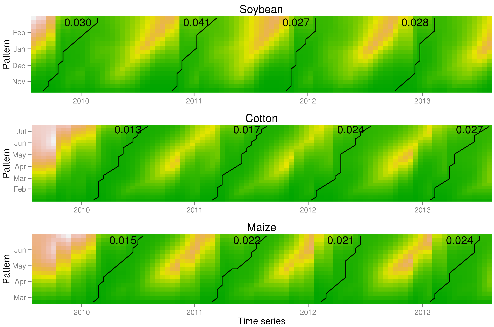

dtwSat
=====

<h3>Time-Weighted Dynamic Time Warping for remote sensing time series analysis</h3>
<ol>
The dtwSat provides a Time-Weighted Dynamic Time Warping (TWDTW) algorithm to measure similarity between two temporal sequences. This adaptation of the classical Dynamic Time Warping (DTW) algorithm is flexible to compare events that have a strong time dependency, such as phenological stages of cropland systems and tropical forests. This package provides methods for visualization of minimum cost paths and time series alignment.
</ol>

<h3>How to use the package:</h3>
<ol>
  <li>Open R</li>
	<li>Install devtools <code>install.packages("devtools")</code></li>
	<li>Load devtools <code>library(devtools)</code></li>
	<li>Install the dtwSat package <code>install_github("vwmaus/dtwSat")</code></li>
</ol>

<h3>Examples:</h3>
<ol>
	<li>Load the dtwSat package: <code>library(dtwSat)</code></li>
	<li>Query names: <code>names(query.list)</code></li>
	<li>Run twdtw alignment for one query: <code>alig = twdtw(query.list[["Soybean"]], template, weight = "logistic", alpha = 0.1, beta = 50, alignments=4, keep=TRUE)</code></li>
	<li>Print dtwSat object: <code>print(alig)</code></li>
	<li>Plot dtwSat object: <code>plot(alig)</code></li>
</ol>

<h3>Plot examples:</h3>
<ol>
 	<li>Plot path for all classese:
 		<code>
			gp.list = lapply(query.list, function(query){
  				alig = twdtw(query, template, weight = "logistic", alpha = 0.1, beta = 50, alignments = 4, keep = TRUE)
  				plot(alig, normalize = TRUE, show.dist = TRUE)  
			})
			gp = arrangeGrob(
				gp.list[[1]] + ggtitle(names(query.list)[1]) + theme(axis.title.x=element_blank()),
                         	gp.list[[2]] + ggtitle(names(query.list)[2]) + theme(axis.title.x=element_blank()),
                         	gp.list[[3]] + ggtitle(names(query.list)[3]) ,
                        	nrow=3)
                        gp
                </code>
        </li>
</ol>

<ol>
   <li>Plot classification:
 		<code>
			malig = mtwdtw(query.list, template, weight = "logistic", 
               alpha = 0.1, beta = 100)
 
      gp = plot(x=malig, type="classify", attribute="evi", from=as.Date("2009-09-01"),  
              to=as.Date("2013-09-01"), by = "6 month",
              normalized=TRUE, overlap=.7) 
      gp
      </code>
  </li>
</ol>

<ol>
  <li>Plot alignments: <code>
  	gp1 = plot(alig, type="alignment", attribute="evi", alignment=1, shift=0.5)
	gp2 = plot(alig, type="alignment", attribute="evi", alignment=2, shift=0.5)
	arrangeGrob(
		gp1 + ggtitle("Alignment 1") + theme(axis.title.x=element_blank(), legend.position="none"),
                gp2 + ggtitle("Alignment 2") + theme(legend.position="none"),
        nrow=2)
        gp
        </code>
   </li>
</ol>
  

<ol>
  <li>Plot alignments: <code>
	df = data.frame(Time=index(template), value=template$evi, variable="Raw")
	df = rbind( df, data.frame(Time=index(sy), value=sy$evi, variable="Wavelet filter") )
	gp = ggplot(df, aes(x=Time, y=value, group=variable, colour=variable)) +
  		geom_line() + 
  		theme(legend.position="bottom") +
  		ylab("EVI")
	gp
        </code>
   </li>
</ol>
  

<h3>How to build the package:</h3>
<ol>
	<li>Clone the project: <code>git clone https//github.com/vwmaus/dtwSat.git</code>.</li>
	<li>Open Rstudio, go to File - Open Project and pick the file <code>dtwSat.Rproj</code>.</li>
	<li>Install the required packages <code>install.packages(c("roxygen2", "testthat"))</code>.</li>
	<li>Go to the <i>Build</i> tab in the upper-right panel and press the button <i>Build & Reload</i>. After this the package is ready to use.</li>
	<li>You can also create a source package: Go to the <i>Build</i> tab, display the menu <i>More</i> and select the option <i>Build Source Package</i>.</li>
</ol> 
